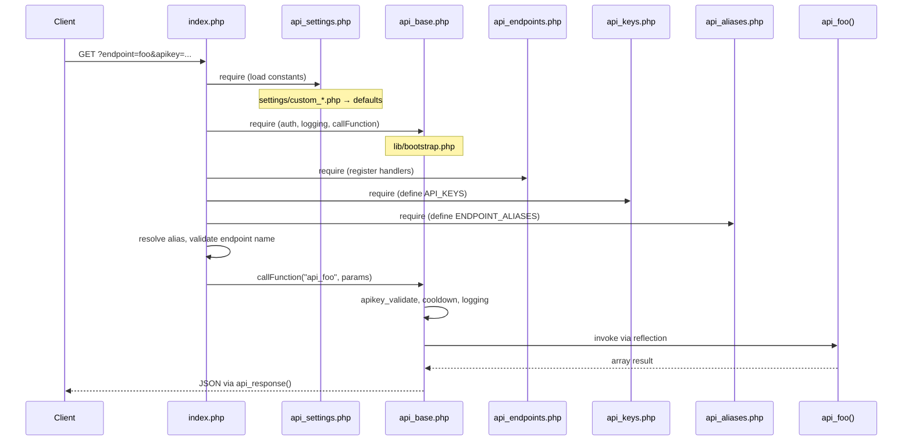
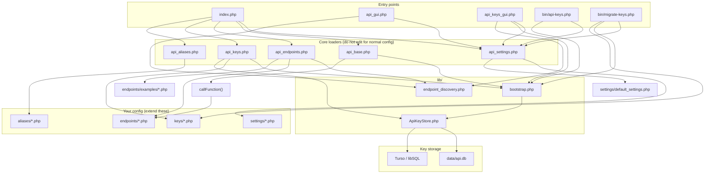

# ⭐ php_api
A simple but customizable API written in PHP. You can configure this API to do anything you can do with PHP.

## ⚠️ Disclaimer
It is important for me to emphasize that this project is created purely for fun, and that there are **a lot** of better alternatives out there.
Should you decide to use this API in a production environment or otherwise, you are doing so at your own risk.
I will not take responsibility or be held liable for any consequences of doing so.

## 📖 Table of contents
- [⭐ php\_api](#-php_api)
  - [⚠️ Disclaimer](#️-disclaimer)
  - [📖 Table of contents](#-table-of-contents)
  - [☑️ Prerequisites](#️-prerequisites)
  - [💻 Installing](#-installing)
  - [🏗️ Architecture](#️-architecture)
    - [Request flow](#request-flow)
    - [How files connect](#how-files-connect)
    - [Directory layout](#directory-layout)
  - [⚙️ Configuration](#️-configuration)
    - [📄 File summary](#-file-summary)
    - [🪛 Settings](#-settings)
    - [🔑 Keys](#-keys)
    - [💬 Endpoints](#-endpoints)
    - [🟰 Endpoint Aliases](#-endpoint-aliases)
    - [🧱 Base](#-base)
  - [🧑‍💻 Using the API](#-using-the-api)
  - [🙋‍♂️ What's next?](#️-whats-next)

<!-- ─────────────────────────────────────────────────────────────────────── -->
<!--                              Prerequisites                              -->
<!-- ─────────────────────────────────────────────────────────────────────── -->
<hr>

## ☑️ Prerequisites
- [x] A webserver running PHP. (Recommended version is 8.1 or above, versions from 7.3 and above should work but is untested).
- [x] A good understanding of the PHP language.
- [x] Basic understanding of API / HTTP request handling.

<!-- ─────────────────────────────────────────────────────────────────────── -->
<!--                               Installing                                -->
<!-- ─────────────────────────────────────────────────────────────────────── -->
<hr>

## 💻 Installing
You can start using this on your webserver by simply downloading the [latest stable release](https://github.com/Darknetzz/php_api/releases/latest) and unzip it to your webserver.

or if you want the latest unstable release, you can clone this repository to your webroot folder:
```bash
$ cd /var/www/html
$ git clone https://github.com/Darknetzz/php_api.git
```

If you want the **bleeding edge** dev release, git clone the dev branch instead.
```bash
$ cd /var/www/html
$ git clone -b dev https://github.com/Darknetzz/php_api.git
```

You have now installed the API to https://<YOUR_SERVER>/php_api

<!-- ─────────────────────────────────────────────────────────────────────── -->
<!--                               Architecture                              -->
<!-- ─────────────────────────────────────────────────────────────────────── -->
<hr>

## 🏗️ Architecture

Every HTTP request enters through `index.php`, which loads configuration and endpoint code, then dispatches to an `api_*` function. Customize behavior by adding files under the config folders — you rarely need to edit the core `api_*.php` loaders.

### Request flow



If no `endpoint` parameter is given and `ENABLE_API_GUI` is on, `index.php` redirects to `api_gui.php` instead.

### How files connect



**Load order matters:** settings are applied first (so constants like `KEY_STORE_DRIVER` exist), then `api_base.php` brings in shared helpers, then endpoints register `api_*` functions, then keys populate `API_KEYS`, then aliases populate `ENDPOINT_ALIASES`.

| You change… | Loader | Config folder / store |
| :---------- | :----- | :-------------------- |
| Timeouts, logging, CORS, open endpoints | `api_settings.php` | `settings/my_custom_settings.php`, `settings/custom_*.php` |
| Endpoint handlers | `api_endpoints.php` | `endpoints/my_custom_endpoints.php`, `endpoints/custom_*.php` |
| API keys (file mode) | `api_keys.php` | `keys/my_custom_keys.php`, `keys/custom_*.php` |
| API keys (DB mode) | `api_keys.php` → `ApiKeyStore` | `data/api.db` or Turso; manage via `bin/api-keys.php` |
| Endpoint name aliases | `api_aliases.php` | `aliases/my_custom_aliases.php`, `aliases/custom_*.php` |

`api_includes.php` is an optional alternate bootstrap: if a root-level `custom_api_*.php` exists, it is loaded instead of the matching `api_*.php` file (useful for local overrides without touching tracked core files).

### Directory layout

```
php_api/
├── index.php                 # HTTP entry — routing, validation, JSON output
├── api_settings.php          # Loads settings/*.php → PHP constants
├── api_base.php              # Auth, cooldown, logging, callFunction, api_response
├── api_endpoints.php         # Loads endpoints/*.php → api_*() functions
├── api_keys.php              # Loads keys → API_KEYS constant
├── api_aliases.php           # Loads aliases/*.php → ENDPOINT_ALIASES
├── api_gui.php               # Optional dev UI (endpoint browser)
├── api_keys_gui.php          # Optional admin UI for DB-backed keys
│
├── settings/                 # Configuration overrides
│   ├── default_settings.php  # Documented defaults (loaded last in chain)
│   └── my_custom_settings.php / custom_*.php
│
├── endpoints/                # Your API handlers (api_foo → ?endpoint=foo)
│   ├── my_custom_endpoints.php
│   ├── custom_*.php
│   └── examples/             # Sample endpoints (e.g. quote_funfact)
│
├── keys/                     # Legacy plaintext keys (KEY_STORE_DRIVER=php)
│   └── my_custom_keys.php / custom_*.php
│
├── aliases/                  # Map alias names → canonical endpoint names
│   └── my_custom_aliases.php / custom_*.php
│
├── lib/
│   ├── bootstrap.php         # getApiKeyStore(), auth header helpers
│   ├── ApiKeyStore.php       # SQLite / Turso key storage (hashed)
│   └── endpoint_discovery.php
│
├── bin/
│   ├── api-keys.php          # CLI: list, create, disable keys (DB mode)
│   └── migrate-keys.php      # Import keys/*.php → database
│
├── data/                     # SQLite DB (gitignored; created at runtime)
└── tests/                    # PHPUnit (ApiKeyStore, auth helpers)
```

<!-- ─────────────────────────────────────────────────────────────────────── -->
<!--                               Configuring                               -->
<!-- ─────────────────────────────────────────────────────────────────────── -->
<hr>

## ⚙️ Configuration
All you need to do now is configure it to your likings, in order to do this, you need to take a look at the included files.

<!-- ──────────────────────────── File summary ───────────────────────────── -->
### 📄 File summary
| File/Folder                              | Description                                                                                                      |
| :--------------------------------------- | :--------------------------------------------------------------------------------------------------------------- |
| [settings/](#-settings)                  | Folder containing settings files. Edit `my_custom_settings.php` to customize your API settings.                 |
| [keys/](#-keys)                          | Folder containing API keys. Add your keys in `my_custom_keys.php`. Pro tip: [Use a generator!](https://roste.org/rand/#rsgen) |
| [endpoints/](#-endpoints)                | Folder containing endpoint definitions. Create your endpoints in `my_custom_endpoints.php` or separate files.   |
| [aliases/](#-endpoint-aliases)           | Folder containing endpoint aliases. Define aliases in `my_custom_aliases.php` or separate files.                |
| [api_base.php](#-base)                   | The most fundamental functions. Don't change this file unless you know what you are doing.                       |


<!-- ──────────────────────────── API Settings ───────────────────────────── -->
### 🪛 Settings
[`settings/`](#-settings)

This is where most of the actual configuration is done.

**Configuration files:**
- `default_settings.php` - Contains all default settings with documentation. Review this file to see available options.
- `my_custom_settings.php` - Create your custom settings here. Settings defined here override the defaults.

You can also create additional settings files in the `settings/` folder, and they will be automatically loaded.

**Example custom settings:**
```php
$customs = [
    "LOG_ENABLE"   => true,
    "LOG_LEVEL"    => "verbose",
    "VERBOSE_API"  => false,
    # Add more custom settings here
];
```

**Available settings options:**

| CONSTANT                 | DESCRIPTION                                                                                           | DEFAULT                                                                       |
| :----------------------- | :---------------------------------------------------------------------------------------------------- | :---------------------------------------------------------------------------- |
| `ENABLE_CUSTOM_INDEX`    | Whether or not to enable a custom index.php if no endpoint or parameters are given.                   | `false`                                                                       |
| `CUSTOM_INDEX_NOPARAMS`  | If `ENABLE_CUSTOM_INDEX` is true, the user will be redirected to this page. Can be URL or local file. | `custom_index.php`                                                            |
| `HTTP_STATUS_CODES`      | HTTP status code translations. Should not be changed.                                                 | `Array`                                                                       |
| `DEFAULT_FILTER`         |                                                                                                       | `null`                                                                        |
| `DEFAULT_JSON_COMPACT`   |                                                                                                       | `false`                                                                       |
| `VERBOSE_API`            |                                                                                                       | `false`                                                                       |
| `NOTIFY_API`             | Whether or not to enable notifications of endpoint usage.                                             | `false`                                                                       |
| `NOTIFY_NUMBER`          | If `NOTIFY_API` is enabled (and properly configured), this number will recieve an SMS.                | `"12345678"`                                                                  |
| `LOG_ENABLE`             | Whether or not to enable logging.                                                                     | `true`                                                                        |
| `LOG_FILE`               | Log file to write logs to if `LOG_ENABLE` is true.                                                    | `"api.log"`                                                                   |
| `LOG_LEVEL`              | Default log level                                                                                     | `"info"`                                                                      |
| `LOG_LEVELS`             | Different levels of logging. Should not be changed.                                                   | `'WARNING' => 10``'INFO' => 20``'VERBOSE' => 30`                              |
| `GLOBAL_PARAMS`          | An array of global parameters which can be used anywhere (regardless of endpoint)                     | `"apikey"``"endpoint"``"filter"``"filterdata"``"clean"``"compact"``"verbose"` |
| `VALID_FILTERS`          |                                                                                                       |                                                                               |
| `OPEN_ENDPOINTS`         |                                                                                                       |                                                                               |
| `NOW`                    | Microtime (now) - used for updating LAST_CALLED_JSON                                                  | `round(microtime(true))`                                                      |
| `LAST_CALLED_JSON`       | Filename to store timestamps of last called endpoints                                                 | `endpoints_lastcalled.json`                                                   |
| `SLEEP_TIME`             | Specifies how long an API call will sleep before sending a response (to prevent spam)                 | `2`                                                                           |
| `COOLDOWN_TIME`          | Specifies how long caller must wait between queries to the same endpoint                              | `5`                                                                           |
| `APIKEY_DEFAULT_OPTIONS` |                                                                                                       |                                                                               |
| `FUNNY_RESPONSES_ENABLE` |                                                                                                       | `true`                                                                        |
| `WHITELIST_MODE`         | Specifies whether to use whitelist mode for endpoints                                                 | `true`                                                                        |


<!-- ────────────────────────────── API Keys ─────────────────────────────── -->
### 🔑 Keys
[`keys/`](#-keys)

> :warning: **Warning**: Please do not reuse API keys found anywhere! Generate your own keys at [roste.org](https://roste.org/rand/#rsgen).

API keys can be stored in a **SQLite database** (recommended) or legacy PHP files.

#### SQLite key store (recommended)

In your hostname settings file (e.g. `settings/custom_ubuntu01.php`):

```php
"KEY_STORE_DRIVER" => "sqlite",
"KEY_STORE_DSN"    => "/var/lib/php-api/api.db",  // outside webroot in production
```

Migrate existing keys from `keys/custom_api_keys.php`:

```bash
php bin/migrate-keys.php          # import existing keys (hashed in DB)
php bin/migrate-keys.php --rotate # import with new random keys
php bin/api-keys.php list
php bin/api-keys.php create MyService --endpoint=datetime
```

Authentication accepts the key via query param (`apikey`) or HTTP header (`apikey`, `X-Api-Key`, or `Authorization: Bearer`).

#### Turso (multi-host / cloud)

Requires `composer require turso/libsql` and:

```php
"KEY_STORE_DRIVER" => "turso",
"KEY_STORE_URL"    => "libsql://your-db.turso.io",
"KEY_STORE_TOKEN"  => getenv("TURSO_AUTH_TOKEN"),
```

#### Legacy PHP file keys

Set `KEY_STORE_DRIVER` to `php` and define keys in `keys/custom_api_keys.php`:

````php
addAPIKey(
    name: "MasterKey",
    key: "your-generated-key-here",
    options: [
        "allowedEndpoints" => ["testEndpoint", "anotherEndpoint"], 
        "noTimeOut"        => true           , 
        "notify"           => false          , 
    ]
);
````

You can also organize keys by creating multiple files in the `keys/` folder. All PHP files in this folder will be automatically loaded when using the `php` driver.

**Option parameters**
| TYPE    | NAME                  | DEFAULT VALUE   | DESCRIPTION                                                                                             |
| :------ | :-------------------- | :-------------- | ------------------------------------------------------------------------------------------------------- |
| `array` | `allowedEndpoints`    | `["*"]`         | Endpoints this key has access to. If there is a * in the array the key will be unrestricted.            |
| `array` | `disallowedEndpoints` | `[]`            | Endpoints this key specifically doesn't have access to, will override allowedEndpoints                  |
| `bool`  | `noTimeOut`           | `false`         | Specify if this key can bypass the timeout                                                              |
| `int`   | `timeout`             | `COOLDOWN_TIME` | Time in seconds this key has to wait between API calls (COOLDOWN_TIME is defined in settings/default_settings.php) |
| `bool`  | `notify`              | `true`          | Whether or not to notify the owner of this API when an endpoint is used.                                |
| `bool`  | `log_write`           | `true`          | Whether or not to write requests with this API key to a log file of your choosing.                      |


<!-- ─────────────────────────────────────────────────────────────────────── -->
<!--                              API ENDPOINTS                              -->
<!-- ─────────────────────────────────────────────────────────────────────── -->
### 💬 Endpoints
[`endpoints/`](#-endpoints)

To create an endpoint that you can talk to, open up the file `endpoints/my_custom_endpoints.php`.

You can organize your endpoints by creating multiple files in the `endpoints/` folder. All PHP files in this folder will be automatically loaded.

Here are some example endpoints you can configure:


<!-- ─────────────────────────────────────────────────────────────────────── -->
<!--                                 API_IP                                  -->
<!-- ─────────────────────────────────────────────────────────────────────── -->
- ##### ➡️ <font size="5">api_ip</font>
    Here is an example of an endpoint that returns the user's IP address.

    ````php
    function api_ip() {
        $ip = (!empty($_SERVER['HTTP_X_FORWARDED_FOR']) ? $_SERVER['HTTP_X_FORWARDED_FOR'] : $_SERVER['REMOTE_ADDR']);
        return ["ip" => $ip];
    }
    ````

<!-- ─────────────────────────────────────────────────────────────────────── -->
<!--                                API_ECHO                                 -->
<!-- ─────────────────────────────────────────────────────────────────────── -->
- ##### ➡️ <font size="5">api_echo</font>
    The first parameter `$input` is required in this endpoint, but if the parameter has a default value, like `$append` in this example,
    it will be optional.

    ````php
    function api_echo(string $input, string $append = "Optional parameter") {
        return ["This can be anything." => "You typed $input. But the second parameter is $append."];
    }
    ````

    - With no parameters provided:

        `/api/?endpoint=echo:`
        ````json
        {"httpCode":500,"status":"ERROR","data":"Alright now you are confusing me... I need 1 parameters for this function to work, but for some reason you gave me only 0."}
        ````

    - With only required parameter provided:

        `/api/?endpoint=echo&input=test`
        ````json
        {"httpCode":200,"status":"OK","data":{"response":{"This can be anything.":"You typed test. But the second parameter is Optional parameter."}}}
        ````

    - With required and optional parameter provided:

        `/api/?endpoint=echo&input=test&append=help`
        ````json
        {"httpCode":200,"status":"OK","data":{"response":{"This can be anything.":"You typed test. But the second parameter is help."}}}
        ````

<!-- ─────────────────────────────────────────────────────────────────────── -->
<!--                              API_GENSTRING                              -->
<!-- ─────────────────────────────────────────────────────────────────────── -->
- #### ➡️ <font size="5">api_genstring</font>
    This endpoint will return a randomly generated string of `$len` length.

    ````php
    function api_genstring(int $len = 32) : array {
        $chars = array_merge(range('a', 'z'),range('A', 'Z'),range('0', '9'));
        $string = "";
        for ($i = 0; $i < $len; $i++) {
            $rand = mt_rand(0, count($chars)-1);
            $string .= $chars[$rand];
        }
        return ["string" => $string];
    }
    ````

    ````bash
    curl -X 'GET' \
    'https://<YOUR-SERVER>/php_api/?endpoint=genstring' \
    -H 'accept: application/json' \
    -H 'apikey: nrTv7xL6qyoOhWH7VBoh0Fs9JwChcoBNLhj1Us7l7zQKENBT0N8cZwDwB48YPdRL'
    ````

    ````json
    {"httpCode":200,"status":"OK","data":{"response":{"string":"3Pyir18QabZz5udOX8tkbQQwxY07nB5K"}}}
    ````


<!-- ─────────────────────────────────────────────────────────────────────── -->
<!--                          API Endpoint Aliases                           -->
<!-- ─────────────────────────────────────────────────────────────────────── -->
### 🟰 Endpoint Aliases
[`aliases/`](#-endpoint-aliases)

Here you can put your aliases in the `aliases/my_custom_aliases.php` file, or create additional files in the `aliases/` folder. All PHP files in this folder will be automatically loaded.

The structure must be as follows:
````php
$aliases = [
        # Main function           # An array of aliases
        "api_main_function"    => ["api_alias_function_1", "api_alias_function_2"],
        "api_another_function" => ["api_another_function_alias", "api_af_short"],
];
````

These aliases will work for both "internal"/"base" functions and endpoints.


<!-- ─────────────────────────────────────────────────────────────────────── -->
<!--                                API Base                                 -->
<!-- ─────────────────────────────────────────────────────────────────────── -->
### 🧱 Base
[`api_base.php`](#-base)

This file is the fundament for this API. You should not have to edit this file to customize the API sufficiently.
But if you must, here are the functions and their purpose:
| FUNCTION     | PURPOSE                                                         | PARAMETERS                                                              |
| :----------- | :-------------------------------------------------------------- | :---------------------------------------------------------------------- |
| `err`        | This function will return an error                              | string `$text`int `$statusCode` = `500`bool `$fatal` = `true`   |
| `var_assert` | Will assert variable (with optional value)                      | mixed `&$var`mixed `$assertVal` = `false`bool `$lazy` = `false` |
| `userIP`     | Should return the user's IP.                                    |                                                                         |
| `fh_close`   | Properly close file handler (used for log_write and lastcalled) | mixed `&$fh`                                                            |


<!-- ─────────────────────────────────────────────────────────────────────── -->
<!--                              Using the API                              -->
<!-- ─────────────────────────────────────────────────────────────────────── -->
<hr>

## 🧑‍💻 Using the API

**cURL**

- With API key as parameter
    ````bash
    $ curl -X GET -H "Content-Type: application/json" https://<YOUR_SERVER>/php_api/?apikey=nrTv7xL6qyoOhWH7VBoh0Fs9JwChcoBNLhj1Us7l7zQKENBT0N8cZwDwB48YPdRL&endpoint=ip
    ````

- With API key as header
    ````bash
    curl -X 'GET' \
    'https://<YOUR-SERVER>/php_api/?endpoint=<ENDPOINT>' \
    -H 'Content-Type: application/json' \
    -H 'apikey: <API_KEY>'
    ````

**PHP**

- queryAPI function
    ````php
    function queryAPI(string $endpoint, array $params = []) {
            $url = 'https://<YOUR_SERVER>/php_api/?endpoint='.$endpoint;
            $uri = buildURL($url, $params);
            $ch = curl_init();
            curl_setopt($ch, CURLOPT_RETURNTRANSFER, true);
            curl_setopt($ch, CURLOPT_FOLLOWLOCATION, true);
            curl_setopt($ch, CURLOPT_URL, $uri);
            $response = json_decode(curl_exec($ch), true);
            curl_close($ch);
            return $response;
    }

    $generateString = queryAPI('genstring');
    echo $generateString;
    ````


<hr>

## 🙋‍♂️ What's next?
I work on this project from time to time with no definitive goal in mind, except for improving what already is. For me this is strictly recreational, although I would happily accept contributions or suggestions for new features or improvements on this project.
